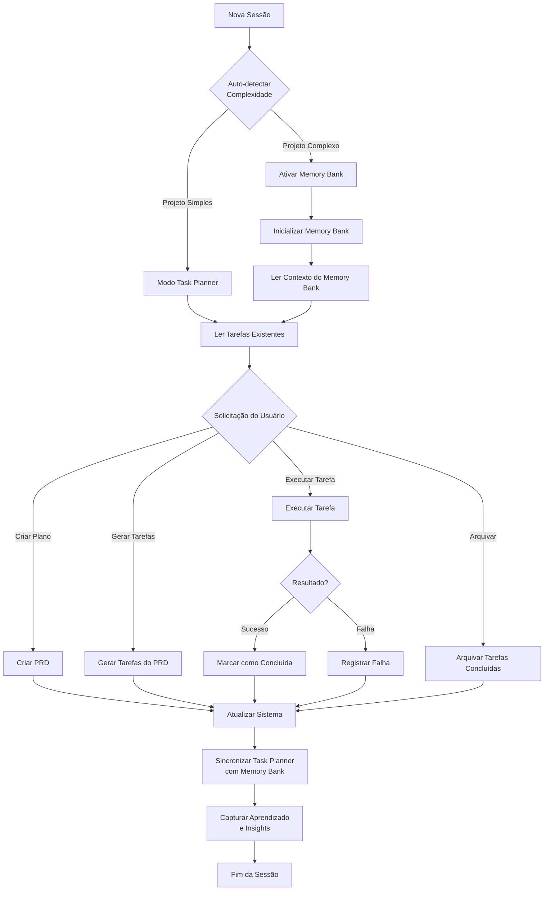

# Task Planner

Um sistema de gerenciamento de projetos baseado em arquivos Markdown, projetado para oferecer rastreamento estruturado de tarefas, planejamento detalhado de recursos e memória persistente entre sessões.

## Visão Geral

Task Planner é uma solução abrangente para gerenciamento de projetos que integra dois componentes principais:

1. **Task Planner**: Framework estruturado para planejar recursos e gerenciar tarefas
2. **Memory Bank**: Sistema opcional de memória persistente para manter contexto entre sessões

O sistema foi projetado para trabalhar com o GitHub Copilot ou assistentes de IA semelhantes, fornecendo uma estrutura persistente baseada em arquivos para gerenciar projetos de software.

## Estrutura de Diretórios

```
task-planner/
├── ai/                        # Diretório de trabalho do Task Planner
│   ├── TASKS.md               # Lista de verificação principal de tarefas ativas
│   ├── tasks/                 # Arquivos individuais de tarefas ativas
│   │   └── task{id}_name.md   # Arquivos de tarefas individuais
│   ├── plans/                 # Documentos de Requisitos do Produto (PRDs)
│   │   ├── PLAN.md            # Visão geral do projeto global
│   │   └── features/          # PRDs de recursos específicos
│   └── memory/                # Histórico de tarefas e planos
│       ├── tasks/             # Tarefas arquivadas
│       ├── plans/             # Planos arquivados
│       ├── TASKS_LOG.md       # Registro histórico de tarefas
│       └── PLANS_LOG.md       # Registro histórico de planos
├── memory-bank/               # Sistema de memória persistente (quando ativo)
│   ├── projectbrief.md        # Definição base do projeto
│   ├── productContext.md      # Objetivos e problemas do produto
│   ├── systemPatterns.md      # Arquitetura e padrões técnicos
│   ├── techContext.md         # Ambiente técnico e tecnologias
│   ├── activeContext.md       # Foco atual de trabalho
│   └── progress.md            # Status atual e progresso
└── instructions/              # Regras do sistema e padrões aprendidos
```

## Componentes Principais

### 1. Task Planner

O Task Planner fornece um framework estruturado para criar, rastrear e gerenciar tarefas de desenvolvimento, desde o planejamento até a conclusão.

**Recursos:**
- Criação e gerenciamento de tarefas com IDs únicos, prioridades e dependências
- Expansão de tarefas complexas em subtarefas gerenciáveis
- Rastreamento de status (pendente, em andamento, concluído, falha)
- Arquivamento de tarefas para referência histórica
- Documentos de Requisitos do Produto (PRDs) detalhados

### 2. Memory Bank

O Memory Bank é um sistema opcional que mantém o contexto persistente entre sessões, ativado automaticamente para projetos complexos.

**Recursos:**
- Documentação estruturada do projeto em arquivos Markdown
- Armazenamento de decisões arquitetônicas e técnicas 
- Contexto do produto e progresso atual
- Integração perfeita com o Task Planner

## Uso do Sistema

### Exemplos de Prompts

#### Inicializar o Sistema
```
Preciso configurar um sistema de gerenciamento para este projeto de [descrição]. Por favor, inicialize o Task Planner com uma estrutura básica.
```

#### Criar um Plano de Projeto
```
Crie um plano detalhado para [nome do projeto/recurso]. O objetivo é [descrição do objetivo], e devemos considerar [requisitos/restrições].
```

#### Gerar Tarefas a partir de um Plano
```
Com base no plano para [nome do recurso], divida-o em tarefas gerenciáveis para implementação.
```

#### Listar Tarefas Atuais
```
Mostre todas as tarefas ativas no momento, com seus status e dependências.
```

#### Trabalhar em uma Tarefa Específica
```
Quero trabalhar na tarefa [ID/descrição]. Por favor, mostre os detalhes e vamos começar.
```

#### Concluir uma Tarefa
```
A tarefa [ID/descrição] foi concluída. Por favor, atualize seu status e verifique se podemos começar alguma tarefa dependente.
```

#### Arquivar Tarefas Concluídas
```
Arquive todas as tarefas concluídas para manter nossa lista de tarefas atual limpa.
```

#### Verificar o Progresso do Projeto
```
Qual é o estado atual do projeto? Quantas tarefas foram concluídas e quantas estão pendentes?
```

## Benefícios

- **Estruturado**: Sistema organizado para planejar e executar o trabalho
- **Persistente**: Mantém contexto entre sessões de uso do assistente de IA
- **Adaptável**: Funciona com projetos de qualquer tamanho
- **Transparente**: Rastreamento claro de decisões e progresso
- **Escalável**: O Memory Bank é ativado automaticamente para projetos complexos

## Fluxo de Trabalho Típico



O fluxo de trabalho do Task Planner segue estas etapas principais:

1. **Inicialização**: O sistema detecta automaticamente se o Memory Bank é necessário
2. **Planejamento**: Criação de PRDs para definir requisitos do projeto
3. **Criação de Tarefas**: Divisão dos PRDs em tarefas gerenciáveis
4. **Execução**: Trabalho nas tarefas com verificações de dependência
5. **Arquivamento**: Movimento de tarefas concluídas para o histórico
6. **Análise**: Revisão do progresso e ajustes nos planos conforme necessário
