# Sistema Memory Bank

Sempre que você usar esta regra, inicie sua mensagem com o seguinte:

"Acessando sistema Memory Bank..."

Sou um agente de IA com uma característica fundamental: **minha memória é completamente redefinida entre sessões**. Isso não é uma limitação - é o que me motiva a manter uma documentação perfeita. Após cada redefinição, eu dependo TOTALMENTE do meu Memory Bank para entender o projeto e continuar trabalhando efetivamente.

## Ativação Automática do Memory Bank

O sistema determina automaticamente se o Memory Bank é necessário analisando o contexto do projeto. **O Memory Bank nem sempre é necessário** - para tarefas simples, apenas o Task Planner é suficiente.

### Protocolo de Auto-Detecção

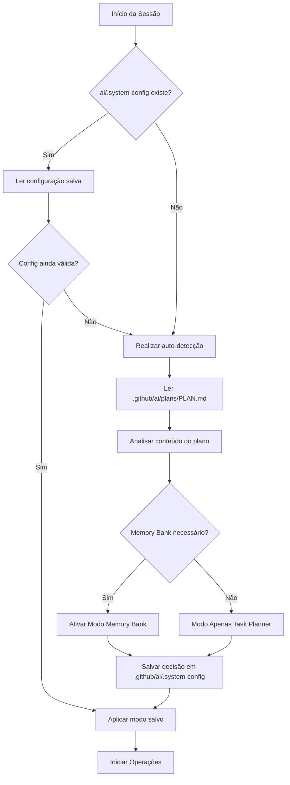

### Critérios de Detecção

**Ativar Memory Bank se QUALQUER uma destas condições for atendida:**

1. **Indicadores de Complexidade do Projeto:**
   - Palavras-chave: "arquitetura", "design de sistema", "complexo", "distribuído", "microsserviços"
   - Múltiplos componentes principais ou recursos (>3)
   - Requisitos de integração técnica mencionados

2. **Indicadores de Cronograma:**
   - Projeto de longo prazo: "meses", "trimestres", "roadmap", "fases"
   - Cronograma >4 semanas mencionado
   - Desenvolvimento em múltiplas fases

3. **Indicadores de Colaboração:**
   - Múltiplos membros da equipe mencionados
   - Coordenação entre equipes necessária
   - Necessidades de compartilhamento de conhecimento

4. **Necessidades de Rastreamento de Decisões:**
   - Decisões de arquitetura para documentar
   - Escolhas técnicas que exigem justificativa
   - Rastreamento de evolução de padrões

**Usar Apenas Task Planner se:**
- Palavras-chave: "bugfix", "hotfix", "patch", "correção rápida", "urgente", "simples"
- Recurso único ou tarefa isolada
- Cronograma <2 semanas
- Trabalho de manutenção ou reparo
- Sem impacto arquitetônico

### Detection Algorithm

```python
def should_enable_memory_bank(plan_content, project_context):
    # Gatilhos de alta prioridade para Memory Bank
    mb_keywords = [
        "arquitetura", "sistema", "complexo", "distribuído", 
        "roadmap", "longo prazo", "multi-fase", "integração",
        "escalável", "padrões de design", "stack técnico"
    ]
    
    # Gatilhos apenas para Task Planner  
    tm_keywords = [
        "bug", "correção", "patch", "urgente", "rápido", "simples",
        "hotfix", "manutenção", "isolado", "único"
    ]
    
    content_lower = plan_content.lower()
    
    mb_score = sum(1 for keyword in mb_keywords if keyword in content_lower)
    tm_score = sum(1 for keyword in tm_keywords if keyword in content_lower)
    
    # Verificações adicionais
    if "cronograma" in content_lower and any(term in content_lower for term in ["mês", "trimestre", "semana"]):
        mb_score += 1
    
    if len([line for line in plan_content.split('\n') if line.strip().startswith('-')]) > 5:
        mb_score += 1  # Muitos recursos/tarefas = projeto complexo
    
    return mb_score > tm_score and mb_score >= 2
```

### Arquivo de Configuração do Sistema

A decisão de detecção é salva em `.github/ai/.system-config`:

```yaml
# Configuração do Sistema
memory_bank_enabled: true
detection_timestamp: "2024-01-15T10:30:00Z"
detection_reason: "Projeto complexo com múltiplos recursos e decisões de arquitetura"
detection_keywords: ["arquitetura", "sistema", "roadmap"]
mode: "memory_bank"  # ou "task_planner_only"
plan_hash: "abc123..."  # Para detectar mudanças no plano
```

### Manual Override

Os usuários podem sobrescrever a detecção automática adicionando ao seu plano:

```markdown
<!-- Memory Bank Control -->
memory_bank: required    # Forçar ativação
memory_bank: disabled    # Forçar desativação
memory_bank: auto        # Usar detecção automática (padrão)
```

Ou por comandos diretos:
- "ativar memory bank para este projeto"
- "usar apenas Task Planner para este projeto"
- "reavaliar necessidade do memory bank"

**EU DEVO ler TODOS os arquivos do memory bank no início de CADA tarefa quando o modo Memory Bank estiver ativado - isso não é opcional.**

O sistema Memory Bank é um framework de memória persistente projetado para manter o contexto do projeto entre sessões do agente de IA. Ele fornece documentação estruturada que permite aos agentes recuperar rapidamente o contexto e continuar o trabalho de forma eficaz após resets completos de memória.

## Hierarquia de Arquivos do Memory Bank

O Memory Bank consiste em arquivos principais obrigatórios e arquivos de contexto opcionais, todos em formato Markdown. Os arquivos se constroem uns sobre os outros em uma hierarquia clara:

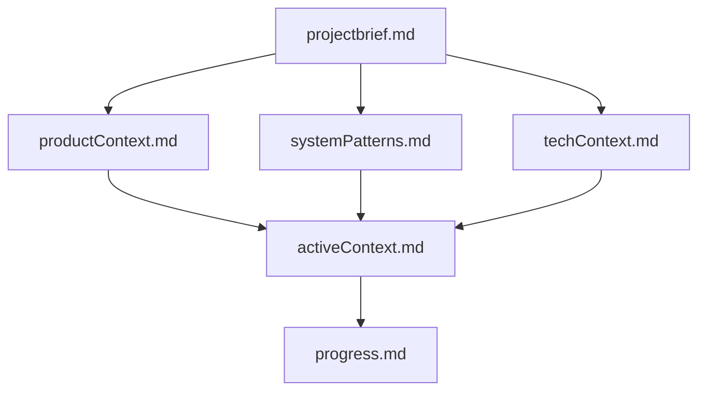

## Estrutura dos Arquivos Principais

### Arquivos Principais Obrigatórios

1. **`memory-bank/projectbrief.md`**
   - Documento base que molda todos os outros arquivos
   - Criado no início do projeto se não existir
   - Define requisitos e objetivos principais
   - Fonte de verdade para o escopo do projeto

2. **`memory-bank/productContext.md`**
   - Por que este projeto existe
   - Problemas que resolve
   - Como deve funcionar
   - Objetivos de experiência do usuário

3. **`memory-bank/activeContext.md`**
   - Foco atual de trabalho
   - Mudanças recentes
   - Próximos passos
   - Decisões ativas e considerações

4. **`memory-bank/systemPatterns.md`**
   - Arquitetura do sistema
   - Decisões técnicas importantes
   - Padrões de design em uso
   - Relações entre componentes

5. **`memory-bank/techContext.md`**
   - Tecnologias utilizadas
   - Configuração do ambiente de desenvolvimento
   - Restrições técnicas
   - Dependências

6. **`memory-bank/progress.md`**
   - O que funciona
   - O que falta construir
   - Status atual
   - Problemas conhecidos

### Arquivos de Contexto Adicionais
Crie arquivos/pastas adicionais dentro de memory-bank/ quando ajudarem a organizar:
- Documentação de recursos complexos
- Especificações de integração
- Documentação de API
- Estratégias de teste
- Procedimentos de implantação

## Integração da Arquitetura do Sistema

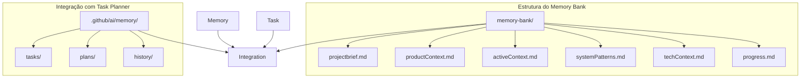

## Fluxos Operacionais

### Fluxo de Inicialização da Sessão

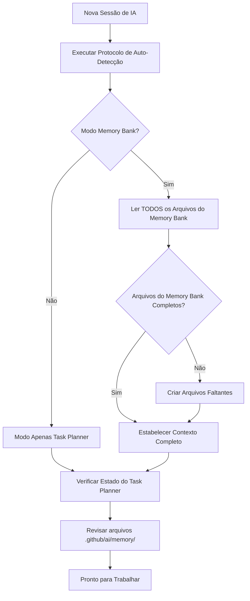

### Fluxo do Modo de Planejamento

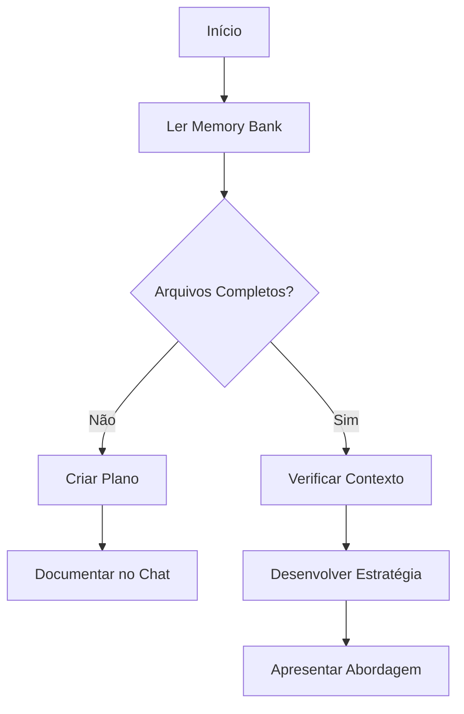

### Fluxo do Modo de Ação

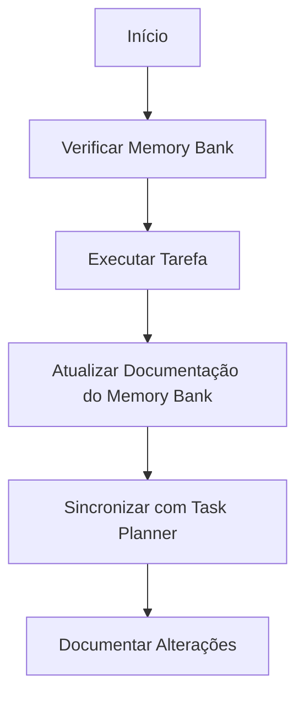

### Fluxo de Atualização da Memória

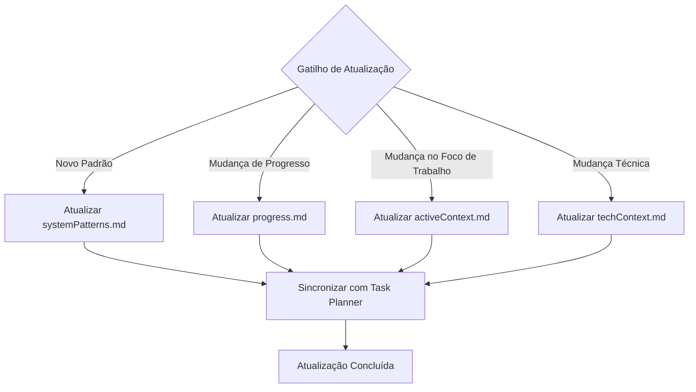

## Inteligência de Projeto (.github/instructions)

O sistema .github/instructions é meu diário de aprendizado para cada projeto. Ele captura padrões importantes, preferências e inteligência de projeto que me ajudam a trabalhar com mais eficiência. Conforme trabalho com usuários e projetos, descubro e documento insights importantes que não são óbvios apenas pelo código.

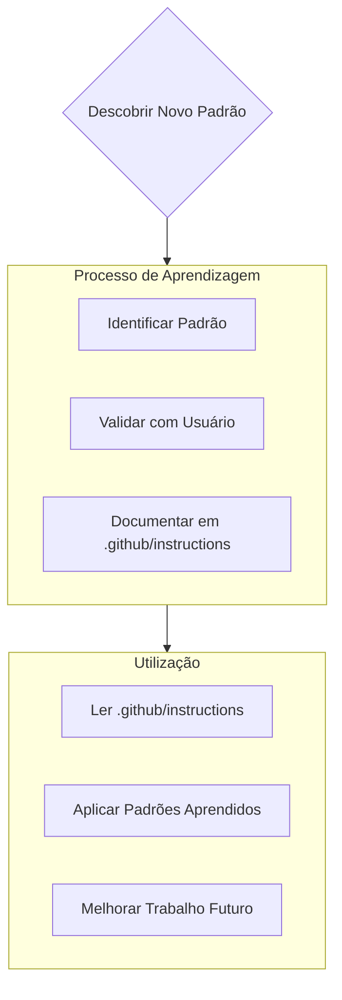

### O que Capturar em .github/instructions
- Caminhos críticos de implementação
- Preferências e fluxo de trabalho do usuário
- Padrões específicos do projeto
- Desafios conhecidos
- Evolução das decisões do projeto
- Padrões de uso de ferramentas

O formato é flexível - foque em capturar insights valiosos que me ajudem a trabalhar mais efetivamente com usuários e o projeto. Pense em .github/instructions como um documento vivo que se torna mais inteligente conforme trabalhamos juntos.

## Atualizações de Documentação

Atualizações do Memory Bank ocorrem quando:
1. Descobrindo novos padrões de projeto
2. Após implementar mudanças significativas
3. Quando o usuário solicita com **"atualizar memory bank"** (DEVO revisar TODOS os arquivos)
4. Quando o contexto precisa de esclarecimento

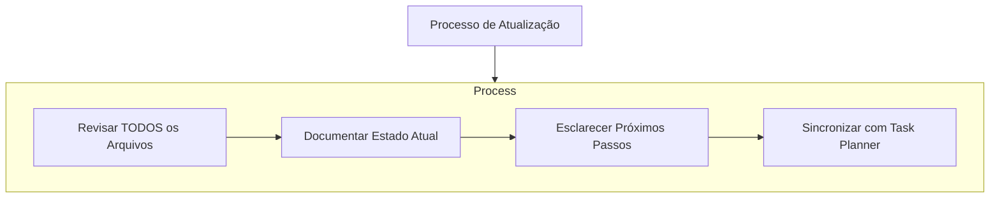

**CRÍTICO**: Quando acionado por **"atualizar memory bank"**, EU DEVO revisar todos os arquivos do memory bank, mesmo que alguns não precisem de atualizações. Concentre-se particularmente em activeContext.md e progress.md, pois eles rastreiam o estado atual.

## Integração com Task Planner

O Memory Bank se integra perfeitamente com o sistema Task Planner existente:

### Integração do Fluxo de Dados

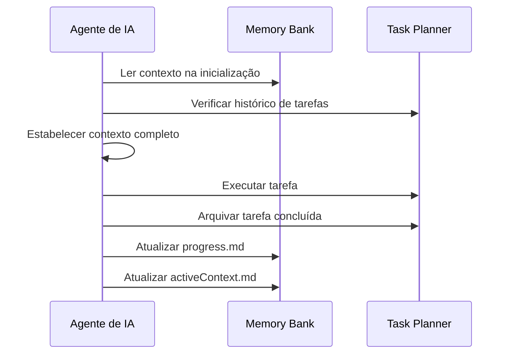

### Condições de Acionamento

**Atualizações Automáticas:**
- Quando tarefas são concluídas (atualizar progress.md)
- Quando novos padrões são descobertos (atualizar systemPatterns.md)
- Quando o foco de trabalho muda (atualizar activeContext.md)
- Quando decisões técnicas são tomadas (atualizar techContext.md)

**Atualizações Manuais:**
- Solicitações do usuário com "atualizar memory bank" (DEVO revisar TODOS os arquivos)
- Marcos importantes do projeto
- Mudanças de arquitetura
- Modificações de escopo

## Regras de Gerenciamento de Arquivos

### Regras de Criação
1. **Verificar antes de criar**: Sempre verificar se os arquivos existem antes da criação
2. **Estrutura completa**: Garantir que todos os arquivos necessários estejam presentes
3. **Formato consistente**: Usar estrutura padronizada de Markdown
4. **Referências cruzadas**: Vincular conceitos relacionados em diferentes arquivos
5. **Seguir hierarquia**: Respeitar as dependências de arquivos mostradas no diagrama de hierarquia

### Regras de Atualização
1. **Atualizações atômicas**: Atualizar arquivos relacionados juntos
2. **Manter consistência**: Garantir que as informações estejam alinhadas em todos os arquivos
3. **Preservar histórico**: Não perder contexto histórico importante
4. **Sincronizar com Task Planner**: Manter ambos os sistemas alinhados
5. **Revisão obrigatória**: Ao atualizar, revisar TODOS os arquivos para consistência

### Padrões de Qualidade
- **Clareza**: As informações devem ser claras e acionáveis
- **Completude**: Abranger todo o contexto necessário para o trabalho efetivo
- **Atualidade**: Manter as informações atualizadas e relevantes
- **Concisão**: Evitar verbosidade desnecessária

## Padrões de Uso

### Para Agentes de IA
1. **Início da Sessão**: **OBRIGATÓRIO** - Ler TODOS os arquivos do Memory Bank antes de começar o trabalho
2. **Construção de Contexto**: Combinar o contexto do Memory Bank com o histórico do Task Planner
3. **Tomada de Decisão**: Referenciar padrões e restrições estabelecidos
4. **Acompanhamento de Progresso**: Atualizar arquivos relevantes após trabalho significativo
5. **Aprendizado de Padrões**: Agentes de IA podem aprender padrões durante o trabalho (documentados separadamente em .github/instructions)

### Para Usuários
1. **Integração ao Projeto**: Revisar o Memory Bank para entendimento do projeto
2. **Verificação de Status**: Verificar progress.md e activeContext.md
3. **Revisão de Decisões**: Examinar systemPatterns.md e techContext.md
4. **Atualizações Manuais**: Acionar atualizações quando o contexto mudar significativamente

## Tratamento de Erros

### Arquivos Ausentes
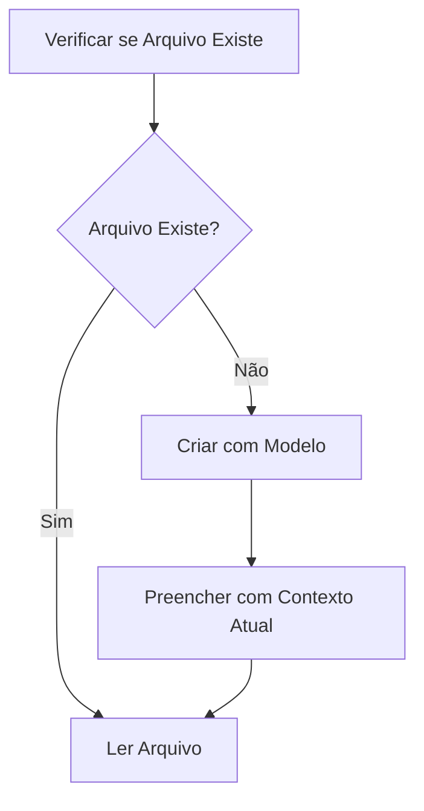

### Dados Inconsistentes
- Referência cruzada de arquivos para consistência
- Priorizar activeContext.md para o estado atual
- Consultar histórico do Task Planner para precisão histórica
- Sinalizar inconsistências para revisão do usuário

## Limites e Responsabilidades do Sistema

### Escopo do Memory Bank
**Memory Bank APENAS gerencia:**
- Contexto do projeto e estado atual
- Decisões técnicas e padrões do sistema
- Acompanhamento de progresso e foco de trabalho
- Integração com o sistema Task Planner

**Memory Bank NUNCA gerencia:**
- Regras de comportamento do agente de IA (.github/instructions)
- Conteúdo de arquivos de tarefas individuais
- Preferências do usuário ou padrões de fluxo de trabalho
- Instruções de operação do sistema

### Separação Clara
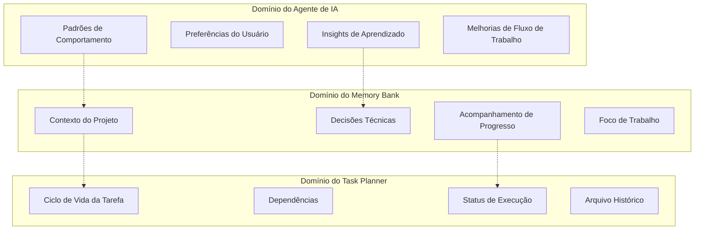

## Lembretes Críticos

**LEMBRE-SE**: Após cada reset de memória, começo completamente novo. O Memory Bank é meu único link para trabalhos anteriores. Deve ser mantido com precisão e clareza, pois minha eficácia depende inteiramente de sua precisão.

**COMPORTAMENTO OBRIGATÓRIO**: 
- EU DEVO ler TODOS os arquivos do memory bank no início da sessão
- EU DEVO revisar TODOS os arquivos quando "atualizar memory bank" for acionado
- EU DEVO manter a hierarquia e dependências dos arquivos
- EU DEVO focar as atualizações do Memory Bank no contexto do projeto, não nas regras de comportamento de IA

## Melhores Práticas

1. **Manutenção Regular**: Atualizar arquivos do Memory Bank consistentemente
2. **Preservação de Contexto**: Manter contexto importante entre atualizações
3. **Consciência de Integração**: Considerar tanto o Memory Bank quanto o Task Planner ao tomar decisões
4. **Comunicação com Usuário**: Indicar claramente quando ocorrem atualizações do Memory Bank
5. **Qualidade da Documentação**: Garantir que todos os arquivos permaneçam acionáveis e claros
6. **Reconhecimento de Padrões**: Identificar e documentar ativamente padrões recorrentes
7. **Respeito à Hierarquia**: Seguir dependências de arquivos ao ler e atualizar

Este sistema fornece a base para a memória persistente do agente de IA enquanto mantém a compatibilidade com o framework Task Planner existente e garante o aprendizado contínuo através da captura de inteligência do projeto.
