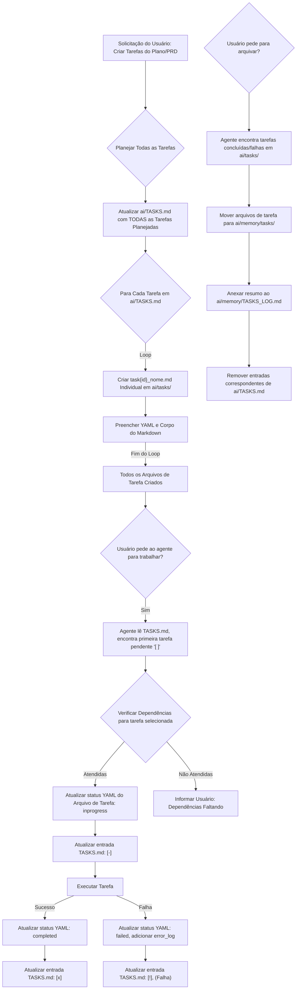

# Regra do Sistema de Gerenciamento de Tarefas de IA

Sempre que você usar esta regra, inicie sua mensagem com o seguinte:

"Verificando tarefas do Task Planner..."

Esta regra especifica os detalhes técnicos para criar e processar tarefas no sistema de tarefas de IA baseado em arquivos do projeto.

## Conceitos Principais

1.  **Pasta Ativa Única:** O diretório `ai/tasks/` contém *todos* os arquivos de tarefas atualmente relevantes, independentemente do seu status (pendente, em andamento, falha). O status da tarefa é rastreado *dentro* do frontmatter YAML de cada arquivo.
2.  **Lista de Verificação Principal:** O arquivo `ai/TASKS.md` atua como a visão geral e interface de controle primária legível por humanos. É uma lista de verificação simples em Markdown que **deve** espelhar o estado das tarefas atualmente em `ai/tasks/`. **O agente é responsável por manter este arquivo sincronizado com o status YAML nos arquivos de tarefas individuais.**
3.  **Arquivo:** O diretório `ai/memory/tasks/` é usado exclusivamente para armazenar arquivos de tarefas que foram totalmente concluídos ou falharam e não precisam mais de rastreamento ativo em `ai/TASKS.md`. O próprio diretório `ai/memory/` contém o arquivo de registro.
4.  **Registro de Arquivo:** O arquivo `ai/memory/TASKS_LOG.md` é um registro persistente, apenas para adição. Quando as tarefas são arquivadas de `ai/tasks/` para `ai/memory/tasks/`, uma linha de resumo para cada uma é adicionada aqui.

## Estrutura de Diretório

```
ai/
  tasks/          # Contém TODOS os arquivos de tarefas ativas (task{id}_nome.md)
  memory/         # Diretório pai para arquivo
    tasks/        # Arquivo para arquivos de tarefas concluídas/falhas
    TASKS_LOG.md  # Registro apenas para adição de tarefas arquivadas
  TASKS.md        # Visão em lista de verificação principal das tarefas em ai/tasks/
```

## Operações Seguras do Sistema de Arquivos

Ao trabalhar com o sistema de tarefas, o agente deve sempre seguir estas melhores práticas para garantir que as operações do sistema de arquivos sejam seguras e idempotentes:

1. **Sempre Verificar a Existência do Diretório Antes de Criar:**
   Antes de criar diretórios como `ai/tasks` ou `ai/memory/tasks`, o agente deve usar a ferramenta `list_dir` no diretório pai (por exemplo, `ai/` ou `ai/memory/`) ou `file_search` para o caminho específico do diretório. Se o diretório não aparecer nos resultados, ele pode ser implicitamente criado ao usar `edit_file` para criar um arquivo dentro desse caminho, pois `edit_file` criará os diretórios pai necessários.

2. **Sempre Verificar a Existência do Arquivo Antes das Operações Iniciais:**
   Antes de operar em arquivos como `ai/TASKS.md` ou `ai/memory/TASKS_LOG.md`, o agente deve usar a ferramenta `file_search` com o caminho completo do arquivo.
   Se um arquivo não existir e precisar ser criado (por exemplo, criação inicial de `TASKS.md`), o agente deve usar a ferramenta `edit_file`, fornecendo o conteúdo inicial (por exemplo, `"# Tarefas do Projeto\n\n"` para `TASKS.md`).

3. **Usar Operações Seguras de Arquivo:**
   - Ao mover arquivos (por exemplo, durante o arquivamento):
     - **Identificar o caminho de origem (por exemplo, `ai/tasks/task{id}_nome.md`) e o diretório de destino (por exemplo, `ai/memory/tasks/`).**
     - **Garantir que o diretório de destino (por exemplo, `ai/memory/tasks/`) exista. Usar `list_dir` no diretório pai (por exemplo, `ai/memory/`) ou `file_search` para verificar. Se não existir, ele pode ser implicitamente criado ao usar `edit_file` para escrever um arquivo dentro desse caminho (pois `edit_file` cria os diretórios pai necessários), ou o comando `mv` pode criá-lo se for um filho direto.**
     - **Confirmar que o arquivo de origem existe usando `file_search` ou `list_dir` antes de tentar o comando `mv`.**
   - Ao adicionar a arquivos, ler o conteúdo existente com `read_file`, adicionar o novo conteúdo ao que foi lido e, em seguida, usar `edit_file` para escrever o conteúdo combinado de volta no arquivo.
   - Ao ler arquivos, usar `read_file`. Se `file_search` indicou que o arquivo não existe, lidar com isso adequadamente (por exemplo, criando-o se essa for a lógica desejada ou relatando um problema).

4. **Ao Arquivar:**
   Garantir que diretórios como `ai/memory/` e `ai/memory/tasks/` estejam conceitualmente presentes (eles serão criados por `edit_file` se necessário quando a primeira tarefa arquivada for escrita lá).
   Garantir que o arquivo de registro `ai/memory/TASKS_LOG.md` exista (ou será criado) usando `file_search` e depois `edit_file` se precisar ser inicializado ou ter conteúdo adicionado.

**Nota:** Seguir essas práticas, aproveitando ferramentas como `file_search`, `list_dir`, `read_file`, `edit_file` e `delete_file`, evita erros e garante a operação tranquila do sistema de tarefas.

## Formato de Arquivo de Tarefa

Cada tarefa é um arquivo Markdown (`.md`) com frontmatter YAML.

**Convenção de Nome de Arquivo:**

Use o formato `task{id}_nome_descritivo.md`, onde `{id}` é um **ID inteiro sequencial único** para tarefas de nível superior, e `nome_descritivo` é um resumo curto em formato kebab-case do título da tarefa (por exemplo, `pagina_lista_prompt`). Nomes de arquivo de subtarefas seguem `task{id_pai}.{id_sub}_nome_descritivo.md`. **Sempre se refira às tarefas pelo seu ID completo (por exemplo, `7` para uma tarefa de nível superior, `7.1` para uma subtarefa) em dependências e comandos.**

**Determinando o Próximo ID de Tarefa (`{id}` para tarefas de nível superior):**

Ao criar uma nova tarefa de nível superior, determine o próximo ID inteiro sequencial disponível. Para fazer isso, o agente deve:
1. Usar a ferramenta `list_dir` para obter o conteúdo do diretório `ai/tasks/`.
2. Usar a ferramenta `list_dir` para obter o conteúdo do diretório `ai/memory/tasks/`.
3. Combinar as listagens de arquivos. A partir desta lista combinada, identificar todos os nomes de arquivo que *apenas* correspondem ao padrão `task{id}_nome_descritivo.md` (por exemplo, `task1_init.md`, `task123_outro_recurso.md`). Este padrão específico visa tarefas de nível superior, garantindo que nomes de arquivo como `task1.2_sub_recurso.md` sejam excluídos desta geração específica de ID.
4. Para cada nome de arquivo correspondente, analisar a parte numérica `{id}`. Isso envolve extrair o número entre "task" e o primeiro sublinhado.
5. Encontrar o ID numérico mais alto entre todos os IDs analisados para tarefas de nível superior.
6. O próximo ID de tarefa de nível superior é este ID mais alto + 1.
7. Se nenhum arquivo de tarefa de nível superior for encontrado em nenhum dos diretórios, o primeiro ID de tarefa de nível superior é `1`.

**YAML Frontmatter:**

### Nomenclatura, Estrutura e Criação de Subtarefas

Para tarefas que são particularmente grandes ou complexas, elas podem ser expandidas em subtarefas. A regra [task-planner/expand.instructions.md](mdc:.github/rules/task-planner/expand.instructions.md) fornece orientações sobre *quando* e *como* avaliar a complexidade e decidir se uma tarefa *deve ser recomendada* para expansão.

**Se a regra `task-planner/expand.instructions.md` (ou o usuário diretamente) recomendar expandir uma tarefa, o seguinte processo é usado para criar as subtarefas:**

1.  **Receber Definições de Subtarefas:** O agente recebe uma lista de subtarefas propostas, tipicamente incluindo títulos, descrições, prioridades e suas interdependências, bem como o ID da tarefa pai (por exemplo, ID da tarefa pai `42`).
2.  **Convenção de Nome de Arquivo de Subtarefa:**
    *   Para cada subtarefa proposta, determine seu nome de arquivo usando o formato: `task{id_pai}.{id_sub}_nome_descritivo.md`
        *   `{id_pai}`: O ID numérico da tarefa pai original (por exemplo, `42`).
        *   `{id_sub}`: Um inteiro sequencial para a subtarefa (por exemplo, 1, 2, 3), único *dentro do escopo daquele pai*.
        *   Exemplo: `task42.1_implementar_modelo_usuario.md`, `task42.2_criar_endpoints_api.md`.
    *   Para determinar o próximo `{id_sub}` para um determinado `{id_pai}`:
        1.  Usar `list_dir` em `ai/tasks/` e `ai/memory/tasks/`.
        2.  Filtrar por arquivos correspondentes a `task{id_pai}.*_*.md` (por exemplo, `task42.*_*.md`).
        3.  Analisar o `{id_sub}` desses nomes de arquivo (o número entre o primeiro ponto e o sublinhado subsequente).
        4.  O próximo `{id_sub}` é o mais alto encontrado + 1, ou 1 se não existirem arquivos de subtarefas relevantes para esse pai.
3.  **Criar Arquivos de Subtarefas:**
    *   Para cada subtarefa definida:
        *   Criar o arquivo `.md` correspondente no diretório `ai/tasks/` usando `edit_file`.
        *   O campo `id` do frontmatter YAML **deve ser a string de ID completa da subtarefa**, por exemplo, `id: 42.1`.
        *   Preencher o frontmatter YAML (`title`, `status: pending`, `priority`, `feature` (isso pode ser o recurso ou título da tarefa pai, ou um sub-recurso mais específico), `dependencies`, `created_at`).
            *   Dependências para subtarefas podem se referir a outras subtarefas do mesmo pai (por exemplo, `42.2` depende de `42.1`) ou tarefas externas/de nível superior (por exemplo, `15`).
        *   Adicionar as seções `## Description`, `## Details` e `## Test Strategy` conforme fornecidas ou geradas.
4.  **Atualizar Arquivo de Tarefa Pai:**
    *   Modificar o arquivo da tarefa pai original (por exemplo, `task42_implementar_recurso_usuario.md`) usando `edit_file`:
        *   Atualizar sua seção `## Description` para observar que foi expandida e agora serve como uma Tarefa Pai ou rastreador.
        *   Em sua seção `## Details`, adicionar uma lista como:
            ```markdown
            **Subtarefas:**
            - task42.1_implementar_modelo_usuario.md
            - task42.2_criar_endpoints_api.md
            ```
        *   O `status` da tarefa pai pode permanecer `pending` ou `inprogress`. Sua conclusão geralmente depende de todas as suas subtarefas estarem `completed`.
5.  **Atualizar Lista de Verificação Principal `TASKS.md`:**
    *   Usando `read_file` e depois `edit_file` em `ai/TASKS.md`:
        *   Para cada subtarefa recém-criada, adicionar uma nova entrada seguindo o formato padrão. O ID exibido deve ser o ID completo da subtarefa (por exemplo, `ID 42.1`).
        *   A entrada para a tarefa pai em `TASKS.md` também deve ser atualizada para refletir seu novo papel como uma Tarefa Pai/rastreador, potencialmente modificando sua descrição.

**Campo YAML `id` para Subtarefas:**
Crucialmente, o campo `id` no frontmatter YAML para uma subtarefa **deve usar a string com notação de ponto**, não apenas o número do sub-id.
Exemplo para `task42.1_implementar_modelo_usuario.md`:
```yaml
---
id: 42.1 # ID completo da subtarefa
title: 'Implementar Modelo de Usuário'
status: pending
priority: high
feature: 'Recurso de Usuário - Modelos' # Ou referência à tarefa pai
dependencies:
  - 42 # Exemplo: se a tarefa pai tinha alguma fase inicial de configuração
# ... resto do YAML ...
---
```

**Dependências envolvendo Subtarefas:**
Ao listar dependências:
- Uma subtarefa pode depender de outra subtarefa do *mesmo pai*: por exemplo, `task42.2` pode ter `42.1` em sua lista de `dependencies`.
- Uma subtarefa pode depender de uma tarefa regular: por exemplo, `task42.1` pode ter `15` em sua lista de `dependencies`.
- Uma tarefa regular pode depender de uma subtarefa: por exemplo, `task43` pode ter `42.2` em sua lista de `dependencies`.
**Sempre use a string de ID completa da tarefa (por exemplo, `42.1`, `15`) na lista de `dependencies`.**

```yaml
---
id: {id}                   # ID Único da Tarefa. Numérico para tarefas de nível superior (por exemplo, 42). String com notação de ponto para subtarefas (por exemplo, "42.1").
title: 'Título Exemplo da Tarefa'  # Título legível por humanos
status: pending            # Status atual: pending, inprogress, completed, failed
priority: medium           # Prioridade da tarefa: critical, high, medium, low
feature: Exemplo de Recurso   # Área do recurso ou agrupamento lógico
dependencies:              # Lista de IDs de tarefa (numéricos ou string como "42.1") dos quais esta tarefa depende
  - 3
  - 5.2
assigned_agent: null       # Agente atualmente trabalhando (null se pendente/bloqueado/concluído)
created_at: "YYYY-MM-DDTHH:MM:SSZ" # Definido usando a saída do comando date -u +"%Y-%m-%dT%H:%M:%SZ". Nunca hardcode ou adivinhe o valor.
started_at: null           # Set using `date` command when status -> inprogress
completed_at: null         # Set using `date` command when status -> completed or failed
error_log: null            # Reason if status: failed
---
```

### Definindo a Prioridade da Tarefa

Ao criar uma nova tarefa, o agente deve atribuir uma `priority` no frontmatter YAML. As prioridades disponíveis são `critical`, `high`, `medium` e `low`. Para escolher a prioridade correta, considere o seguinte:

*   **`critical`**:
    *   A tarefa é absolutamente essencial para a funcionalidade principal do projeto ou recurso.
    *   O projeto/recurso não pode prosseguir ou ser considerado completo sem esta tarefa.
    *   Pode ser também uma tarefa que, se não for feita imediatamente, bloqueia um grande número de outras tarefas de prioridade `critical` ou `high`.
*   **`high`**:
    *   A tarefa implementa uma parte fundamental de um recurso ou corrige um bug importante.
    *   É um passo significativo em direção a um objetivo principal.
    *   Pode bloquear várias outras tarefas de prioridade `medium` ou `high`.
*   **`medium`** (Padrão):
    *   Isso é para tarefas de desenvolvimento padrão, trabalho regular de recursos ou melhorias que são valiosas, mas não bloqueiam imediatamente.
    *   Use isso como padrão se a tarefa não se encaixa claramente em `critical`, `high` ou `low`.
*   **`low`**:
    *   A tarefa é um "bom ter", uma melhoria menor, uma correção cosmética, ou pode ser adiada sem impacto significativo.
    *   Não bloqueia nenhuma outra tarefa ou só bloqueia outras tarefas de prioridade `low`.

**Processo para decidir a prioridade:**

1.  **Avaliar a Criticidade Inerente:** Quão vital é esta tarefa específica para a solicitação geral do usuário ou o recurso que está sendo construído?
2.  **Analisar Dependências:** Esta tarefa desbloqueia outras tarefas? Se sim, quais são as prioridades dessas tarefas dependentes? Uma tarefa que desbloqueia trabalho de prioridade `critical` ou `high` deve ter sua prioridade elevada de acordo.
3.  **Padrão para Medium:** Se não houver razão forte para atribuir uma prioridade diferente, `medium` geralmente é apropriado.

## Description

(Breve resumo do objetivo da tarefa - usado em TASKS.md)

## Details

(Lista com marcadores de requisitos específicos, etapas ou considerações)

## Test Strategy

(Como verificar se a tarefa foi concluída com sucesso)

**Nota sobre Testes:** Quando a estratégia de teste envolve processos em segundo plano ou tarefas agendadas, prefira testar usando o mecanismo padrão da aplicação para acionar esse processo (por exemplo, uma interface de linha de comando, endpoint de API ou chamada de função específica que inicia a tarefa), em vez de invocar a lógica central da tarefa diretamente em um ambiente de teste isolado se um teste mais integrado for viável. Isso fornece um teste de integração mais realista.

## Agent Notes

(Seção opcional para agentes adicionarem notas durante a execução)

## Granularidade e Estrutura de Tarefas

Ao dividir um recurso ou história de usuário em tarefas, busque um equilíbrio entre granularidade e entrega de partes significativas e autocontidas de funcionalidade. Evite criar tarefas muito pequenas ou excessivamente dependentes de tarefas de acompanhamento imediato.

**Princípios Gerais:**

*   **Autocontida:** Cada tarefa deve idealmente representar um passo lógico que pode ser implementado e potencialmente testado independentemente. Por exemplo, implementar a lógica principal de um trabalho e seus testes unitários constitui uma boa tarefa.
*   **Progresso Significativo:** Concluir uma tarefa deve representar um progresso claro em direção ao objetivo geral do recurso.
*   **Evitar Micro-Tarefas:** Não divida operações únicas em várias tarefas pequenas se elas sempre são realizadas juntas (por exemplo, extrair dados e armazená-los dentro do mesmo trabalho pode ser uma tarefa, não duas ou três).

**Estrutura de Fluxo de Trabalho Recomendada:**

Em vez de detalhar cada detalhe de implementação, considere estruturar tarefas em torno de fases lógicas de desenvolvimento:

1.  **Tarefa de Estruturação:**
    *   **Objetivo:** Criar a estrutura de arquivos necessária e o código básico para o recurso.
    *   **Detalhes:** Isso pode envolver a criação de novos módulos, classes, funções ou arquivos (por exemplo, para comandos, trabalhos em segundo plano, modelos de dados, utilitários de serviço, testes) com estrutura básica (por exemplo, assinaturas de funções, definições de classes) e implementações fictícias de acordo com a linguagem e framework escolhidos pelo projeto.

2.  **Tarefa(s) de Implementação da Lógica Principal:**
    *   **Objetivo:** Implementar a lógica de negócios principal do recurso.
    *   **Detalhes:** Isso envolve escrever o código real dentro dos arquivos estruturados (por exemplo, a lógica dentro da função/método de execução principal de um trabalho) e os testes unitários correspondentes.

3.  **Tarefa(s) de Integração/Controle:**
    *   **Objetivo:** Implementar como a lógica principal é acionada ou integrada à aplicação.
    *   **Detalhes:** Isso pode envolver a implementação de uma interface de linha de comando, um endpoint de API, uma ação de interface do usuário ou uma chamada de serviço que usa a lógica principal. Incluir testes relevantes para esta camada de integração.

4.  **Tarefa(s) de UI/Frontend (Se Aplicável):**
    *   **Objetivo:** Implementar quaisquer elementos de interface do usuário necessários.
    *   **Detalhes:** Criar ou modificar templates, componentes ou visualizações de interface do usuário relevantes para o framework/biblioteca de UI escolhido.

Esta estrutura ajuda a garantir que cada tarefa seja substancial o suficiente para ser significativa, mantendo um fluxo lógico para o desenvolvimento de recursos.

## Lista de Verificação Principal `TASKS.md`

Este arquivo fornece uma visão geral rápida e legível por humanos de todas as tarefas atualmente no diretório `ai/tasks/`.

**CRÍTICO: O agente DEVE atualizar este arquivo imediatamente sempre que o status de um arquivo de tarefa mudar no diretório `ai/tasks/` OU quando novas tarefas forem planejadas em massa (antes que seus arquivos individuais sejam criados).** Ele atua como o ponto central de visualização e coordenação. **Nunca atualize um sem o outro (quando arquivos de tarefa existirem).**

**Formato:** Cada tarefa é representada por um item de lista:

```markdown
- [ÍCONE] **ID {id}: {Título}** (Prioridade: {prioridade}){NOTA_STATUS}
> Dependências: {dep_id1}, {dep_id2}... (Mostrado apenas se existirem dependências)
> {Descrição}
```

-   **`[ÍCONE]`**:
    -   `[ ]`: Pendente
    -   `[-]`: Em Progresso
    -   `[x]`: Concluída
    -   `[!]`: Falha
-   **`{id}`**: O ID completo da tarefa (por exemplo, `15` ou `15.1`).
-   **`{NOTA_STATUS}`**:
    -   `(Falha)`: Se o status for `failed`.
-   **`Dependências`**: Linha é omitida se a lista de `dependencies` no YAML estiver vazia ou nula. IDs são IDs completos de tarefas (por exemplo, `1`, `4.2`).
-   **`Descrição`**: Extraída da seção `## Description` do arquivo da tarefa.

**Exemplo de Entrada em `TASKS.md`:**

```markdown
- [-] **ID 15.1: Implementar API de Login de Usuário** (Prioridade: critical)
> Dependências: 1, 4.2
> Permitir que os usuários façam login via email e senha através da API.
```

## Fluxo de Trabalho

O fluxo de trabalho para o sistema Task Planner é ilustrado em um diagrama separado. Por favor, consulte [task-planner/workflow.md](mdc:.github/rules/task-planner/workflow.md) para o processo detalhado de criação, execução e arquivamento de tarefas.

## Fluxo de Trabalho



**Responsabilidades Principais do Agente:**

1.  **Sincronização:** Manter `ai/TASKS.md` perfeitamente alinhado com os campos `status` nos arquivos `ai/tasks/*.md`. Atualizar `TASKS.md` *imediatamente* após atualizar o status YAML de um arquivo de tarefa.
2.  **Verificação de Dependência:** Antes de mudar o status de uma tarefa para `inprogress` (**após identificá-la como pendente em `TASKS.md`**), verificar se *cada* ID listado em suas `dependencies` corresponde a um arquivo de tarefa (em `ai/tasks/` OU `ai/memory/tasks/`) com `status: completed` em seu YAML. IDs podem ser numéricos (por exemplo, `12`) ou string (por exemplo, `12.1`). **Se não forem atendidas, o agente não pode iniciar a tarefa e deve informar o usuário.**
3.  **Atualizações de Status:**
    *   **Iniciar:** Atualizar YAML do arquivo de tarefa (`status: inprogress`, `assigned_agent`, `started_at`). Atualizar linha `TASKS.md` (`[-]`).
    *   **Completar:** Atualizar YAML do arquivo de tarefa (`status: completed`, `assigned_agent: null`, `completed_at`). Atualizar linha `TASKS.md` (`[x]`).
    *   **Falhar:** Atualizar YAML do arquivo de tarefa (`status: failed`, `assigned_agent: null`, `completed_at`, `error_log`). Atualizar linha `TASKS.md` (`[!]`, adicionar `(Falha)`).
4.  **Arquivamento:** Quando instruído pelo usuário (interpretando a intenção como "arquivar tarefas concluídas", "limpar tarefas finalizadas"), realizar as etapas de arquivamento:
    *   Encontrar tarefas concluídas/falhas **em `ai/tasks/`** lendo seu status YAML (usar `read_file` para cada arquivo de tarefa identificado por `list_dir` em `ai/tasks/`).
    *   Para cada tarefa a ser arquivada:
        *   Ler seu conteúdo completo (frontmatter YAML e seção Description) usando `read_file` **(isso é necessário para registrar no TASKS_LOG.md).**
        *   **Identificar o caminho de origem (por exemplo, `ai/tasks/task{id}_nome.md`) e o diretório de destino (`ai/memory/tasks/`).**
        *   **Garantir que o diretório de destino `ai/memory/tasks/` exista (por exemplo, usando `list_dir` ou `file_search`). Se não existir, normalmente será criado por `edit_file` se um arquivo for escrito nele, ou o comando `mv` pode criá-lo.**
        *   **Usar `run_terminal_cmd` para executar um comando `mv` (por exemplo, `mv ai/tasks/task{id}_nome.md ai/memory/tasks/`).**
    *   Registrar o resumo (incluindo descrição e dependências) no `TASKS_LOG.md` lendo seu conteúdo atual, adicionando as novas entradas de registro e usando `edit_file` para escrever de volta.
    *   Remover entradas correspondentes de `ai/TASKS.md` via `read_file` e `edit_file`.

## Formato do `TASKS_LOG.md`

Ao arquivar, adicione uma entrada para cada tarefa em `ai/memory/TASKS_LOG.md`. Se estiver arquivando várias tarefas como parte de uma única solicitação do usuário (arquivamento em lote), use o *mesmo* timestamp (obtido uma vez no início da operação) para todas as entradas nesse lote.

**Extraia o Título da tarefa, a Descrição (do corpo markdown) e as Dependências (do YAML) antes de mover o arquivo.**

```markdown
- Arquivado **ID {id}: {Título}** (Status: {completed/failed}) em {YYYY-MM-DDTHH:MM:SSZ}
> Dependências: {dep_id1}, {dep_id2}... (Mostrado apenas se dependências existirem no YAML, use IDs completos como 15 ou 15.1)
> {Descrição} (Extraída do arquivo da tarefa)
```

## Interpretação de Comandos do Agente

O agente deve interpretar solicitações do usuário e mapeá-las para as seguintes ações. Use IDs completos de tarefa (numérico para nível superior, string como "7.1" para subtarefas) ao se referir às tarefas.

*   **Mostrar/Listar Tarefas:** Ler e exibir o conteúdo atual de `ai/TASKS.md`.
*   **Criar Tarefa / Criar Subtarefas:**
    *   **Se estiver criando uma tarefa regular de nível superior ou múltiplas tarefas (de um plano/PRD):**
        *   Primeiro, planejar todas as tarefas a serem criadas, determinando seus IDs, títulos, prioridades, dependências e descrições.
        *   Atualizar `ai/TASKS.md` com entradas para TODAS as tarefas planejadas usando `read_file` e `edit_file`.
        *   Depois, para cada tarefa agora listada em `ai/TASKS.md`, criar o arquivo individual `task{id}_nome_descritivo.md` em `ai/tasks/` usando `edit_file`, preenchendo YAML e corpo markdown.
    *   **Se estiver criando subtarefas para um `parent_id` existente (com base em uma recomendação de `@expand.instructions.md` ou usuário):**
        *   Seguir o mesmo processo: planejar todas as subtarefas, atualizar `ai/TASKS.md` com todas as entradas de subtarefas, depois criar cada arquivo `task{id_pai}.{id_sub}_nome_descritivo.md` em `ai/tasks/`.
        *   Atualizar a descrição e detalhes do arquivo da tarefa pai para listar as novas subtarefas usando `edit_file`.
        *   Atualizar a entrada da tarefa pai em `TASKS.md` se sua descrição precisar mudar, usando `read_file` e `edit_file`.
*   **Iniciar/Trabalhar na Próxima Tarefa / Continuar:**
    *   Ler `ai/TASKS.md` e identificar a **primeira** tarefa listada com o ícone `[ ]` (pendente).
    *   Se nenhuma tarefa pendente for encontrada, informar ao usuário.
    *   Se uma tarefa pendente for encontrada, prosseguir para verificar suas dependências (lendo o arquivo da tarefa se necessário).
    *   Se dependências atendidas: Atualizar YAML do arquivo de tarefa (`status: inprogress`, etc.) e atualizar a linha correspondente em `TASKS.md` para `[-]`. Anunciar qual tarefa está sendo iniciada.
    *   Se dependências não atendidas: Informar ao usuário, declarando qual tarefa está bloqueada e quais dependências estão faltando.
*   **Iniciar/Trabalhar em uma Tarefa Específica {id}:**
    *   Verificar se a tarefa {id} (por exemplo, `15` ou `15.1`) existe em `ai/TASKS.md` e seu status é `[ ]` (pendente). Se não, informar ao usuário.
    *   Verificar dependências para a tarefa {id}.
    *   Se atendidas: Atualizar YAML da tarefa {id} (`status: inprogress`, etc.) e atualizar `TASKS.md`.
    *   Se não atendidas: Informar ao usuário que dependências estão faltando.
*   **Verificar Conclusão da Tarefa (ETAPA PRÉ-CONCLUSÃO OBRIGATÓRIA):**
    *   **SEMPRE** verificar se o arquivo da tarefa (por exemplo, `task{id}_nome.md`) contém uma seção `## Test Strategy` após concluir o trabalho de implementação.
    *   Se uma seção `## Test Strategy` existir: **NÃO** marque a tarefa como concluída ainda. Você **DEVE** explicitamente perguntar ao usuário: "Esta tarefa tem uma Estratégia de Teste. Você gostaria de executar os testes (preferencialmente acionando o comando/ação de despacho, se aplicável), ou devo marcá-la como concluída com base na sua verificação?"
    *   Se nenhuma seção `## Test Strategy` existir, ou se o usuário confirmar após ser perguntado sobre os testes: Prosseguir para a etapa "Concluir Tarefa {id}".
*   **Concluir Tarefa {id}:**
    *   **Limpeza:** Antes de marcar como concluída, revisar as alterações de código feitas para esta tarefa e remover quaisquer declarações temporárias de registro ou impressão (por exemplo, impressões de depuração específicas da linguagem, logs de console detalhados) que foram adicionadas para fins de depuração ou teste. Deixar apenas logs que são essenciais para monitoramento de produção (por exemplo, erros, avisos críticos).
    *   **Atualizar:** Atualizar YAML da tarefa {id} (`status: completed`, `assigned_agent: null`, `completed_at`) e atualizar a linha correspondente em `TASKS.md` para `[x]`.
*   **Falhar Tarefa {id} "{Razão}":** Atualizar YAML da tarefa {id} (`status: failed`, `error_log`, etc.) e atualizar `TASKS.md`.
*   **Mostrar Detalhes da Tarefa {id}:** Ler o conteúdo completo (YAML e Markdown) de `task{id}_nome.md` (verificando tanto `ai/tasks` quanto `ai/memory/tasks` para arquivos como `task15_...md` ou `task15.1_...md`) e exibi-lo.
*   **Arquivar Tarefas:**
    *   Identificar tarefas em `ai/tasks/` com `status: completed` ou `status: failed` em seu YAML (usar `list_dir` e depois `read_file` para cada tarefa para verificar o status).
    *   Para cada arquivo de tarefa identificado:
        * Ler seu frontmatter YAML (para obter Título, Status, Dependências) e seu corpo Markdown (para obter a Descrição) usando `read_file`.
    *   Mover arquivos identificados:
        *   **Construir o caminho de origem (por exemplo, `ai/tasks/task{id}_nome.md`) e diretório de destino (`ai/memory/tasks/`).**
        *   **Garantir que o diretório de destino `ai/memory/tasks/` exista (por exemplo, usando `list_dir` ou `file_search`). Se não existir, normalmente será criado por `edit_file` se um arquivo for escrito nele, ou o comando `mv` pode criá-lo.**
        *   **Usar `run_terminal_cmd` para executar um comando `mv` (por exemplo, `mv ai/tasks/task{id}_nome.md ai/memory/tasks/`).**
    *   Adicionar entradas a `ai/memory/TASKS_LOG.md` usando o novo formato (Título, Status, Timestamp, Dependências, Descrição) via `read_file` e `edit_file`.
    *   Remover entradas correspondentes de `ai/TASKS.md` via `read_file` e `edit_file`.

## Utilitários

**Gerar Timestamps:**

**O AGENTE DEVE SEMPRE USAR O UTILITÁRIO FORNECIDO PARA OBTER O TIMESTAMP UTC ATUAL PARA OS CAMPOS `created_at`, `started_at` E `completed_at`. NUNCA HARDCODE OU ADIVINHE A DATA/HORA.**

Use o seguinte comando para obter o timestamp UTC atual:

```bash
date -u +"%Y-%m-%dT%H:%M:%SZ"
```

Espera-se que este comando seja executado com sucesso (código de saída geral 0). A saída conterá o timestamp na primeira linha, seguido por uma linha indicando o código de saída específico do próprio comando `date` (por exemplo, "Date_Command_Exit_Code: 0"). O agente deve usar o timestamp da primeira linha da saída.
