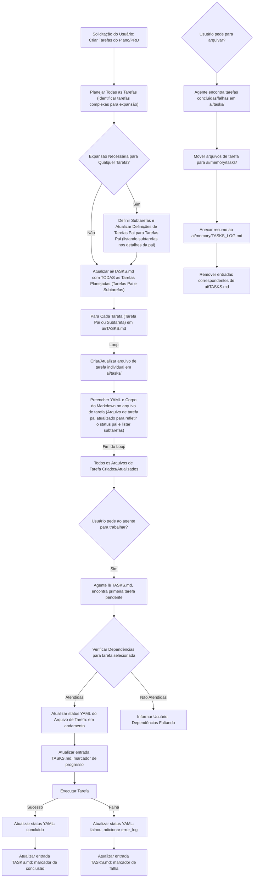

# Diagrama de Fluxo de Trabalho do Task Planner

Abaixo está o diagrama de fluxo de trabalho para o sistema Task Planner, ilustrando o processo de criação, execução e arquivamento de tarefas.

```mermaid
graph TD
    A[Solicitação do Usuário: Criar Tarefas do Plano/PRD] --> B["Planejar Todas as Tarefas (Identificar tarefas complexas para expansão)"];
    B --> B1{Expansão Necessária para Qualquer Tarefa?};
    B1 -- Sim --> B2["Definir Subtarefas e Atualizar Definições de Tarefas Pai para Tarefas Pai (listando subtarefas nos detalhes da pai)"];
    B1 -- Não --> C;
    B2 --> C["Atualizar ai/TASKS.md com TODAS as Tarefas Planejadas (Tarefas Pai e Subtarefas)"];
    C --> D["Para Cada Tarefa (Tarefa Pai ou Subtarefa) em ai/TASKS.md"];
    D -- Loop --> E[Criar/Atualizar arquivo de tarefa individual em ai/tasks/];
    E --> F["Preencher YAML e Corpo do Markdown no arquivo de tarefa (Arquivo de tarefa pai atualizado para refletir o status pai e listar subtarefas)"];
    F -- Fim do Loop --> G[Todos os Arquivos de Tarefa Criados/Atualizados];
    G --> H{Usuário pede ao agente para trabalhar?};
    H -- Sim --> I[Agente lê TASKS.md, encontra primeira tarefa pendente];
    I --> J{Verificar Dependências para tarefa selecionada};
    J -- Atendidas --> K[Atualizar status YAML do Arquivo de Tarefa: em andamento];
    K --> L[Atualizar entrada TASKS.md: marcador de progresso];
    L --> M[Executar Tarefa];
    M -- Sucesso --> N[Atualizar status YAML: concluído];
    N --> O[Atualizar entrada TASKS.md: marcador de conclusão];
    M -- Falha --> P["Atualizar status YAML: falhou, adicionar error_log"];
    P --> Q[Atualizar entrada TASKS.md: marcador de falha];
    J -- Não Atendidas --> R[Informar Usuário: Dependências Faltando];
    S{Usuário pede para arquivar?} --> T[Agente encontra tarefas concluídas/falhas em ai/tasks/];
    T --> U[Mover arquivos de tarefa para ai/memory/tasks/];
    U --> V[Anexar resumo ao ai/memory/TASKS_LOG.md];
    V --> W[Remover entradas correspondentes de ai/TASKS.md];
```
