# Fluxo de Trabalho do Sistema Unificado: Memory Bank + Task Planner

Este documento descreve o fluxo de trabalho operacional completo para o sistema unificado Memory Bank + Task Planner, abrangendo o gerenciamento de sessões do agente de IA, operações de tarefas e padrões de aprendizado contínuo.

## Visão Geral do Sistema

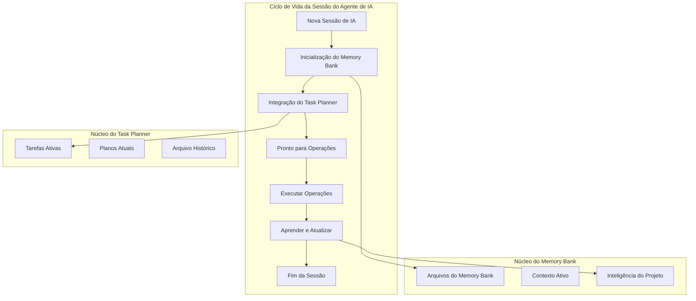

## Fase 1: Inicialização de Sessão

### 1.1 Protocolo de Auto-Detecção (PRIMEIRO PASSO OBRIGATÓRIO)

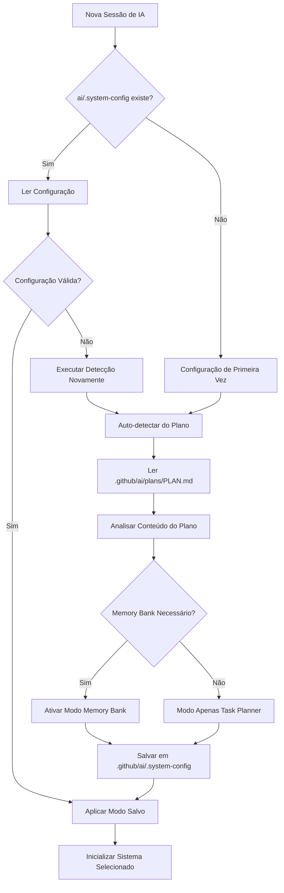

### 1.2 Inicialização do Memory Bank (Quando Ativado)

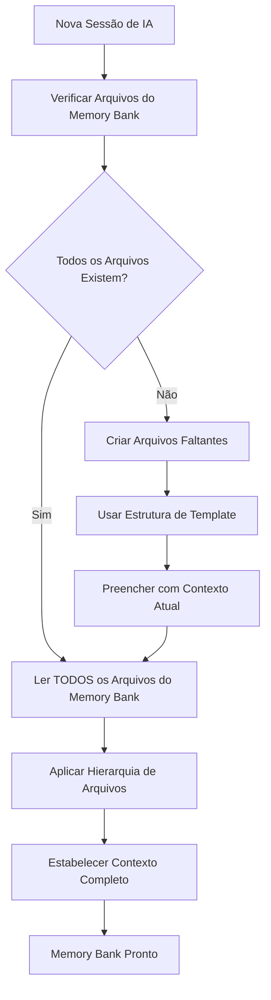

**Ações Obrigatórias:**
1. **Ler `memory-bank/projectbrief.md`** - Entendimento básico
2. **Ler `memory-bank/productContext.md`** - Objetivos e problemas do produto
3. **Ler `memory-bank/systemPatterns.md`** - Arquitetura e padrões
4. **Ler `memory-bank/techContext.md`** - Ambiente técnico
5. **Ler `memory-bank/activeContext.md`** - Foco atual de trabalho
6. **Ler `memory-bank/progress.md`** - Status atual e progresso

### 1.3 Integração do Task Planner (Sempre Ativo)

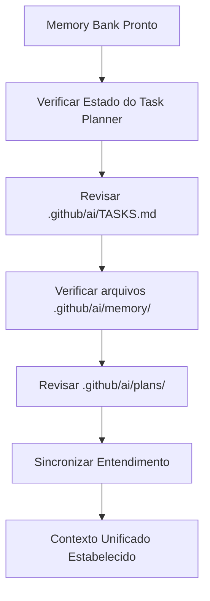

## Fase 2: Modos de Operação

### 2.1 Fluxo do Modo de Planejamento

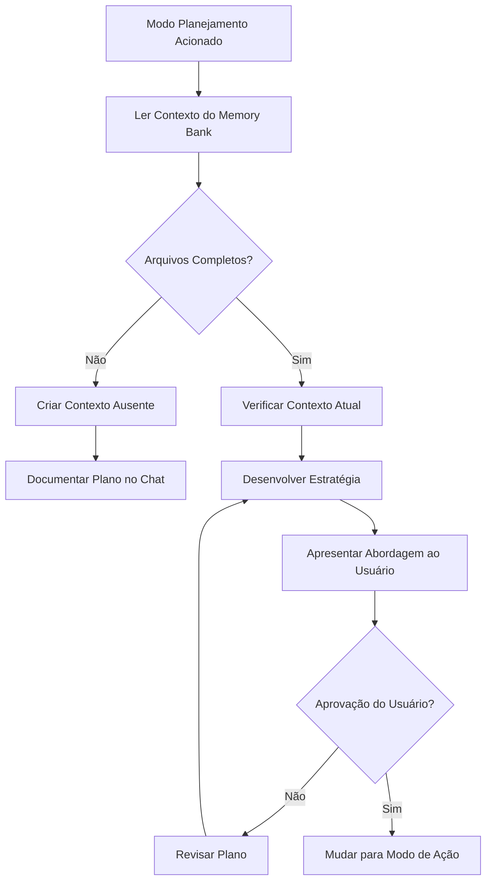

### 2.2 Fluxo do Modo de Ação

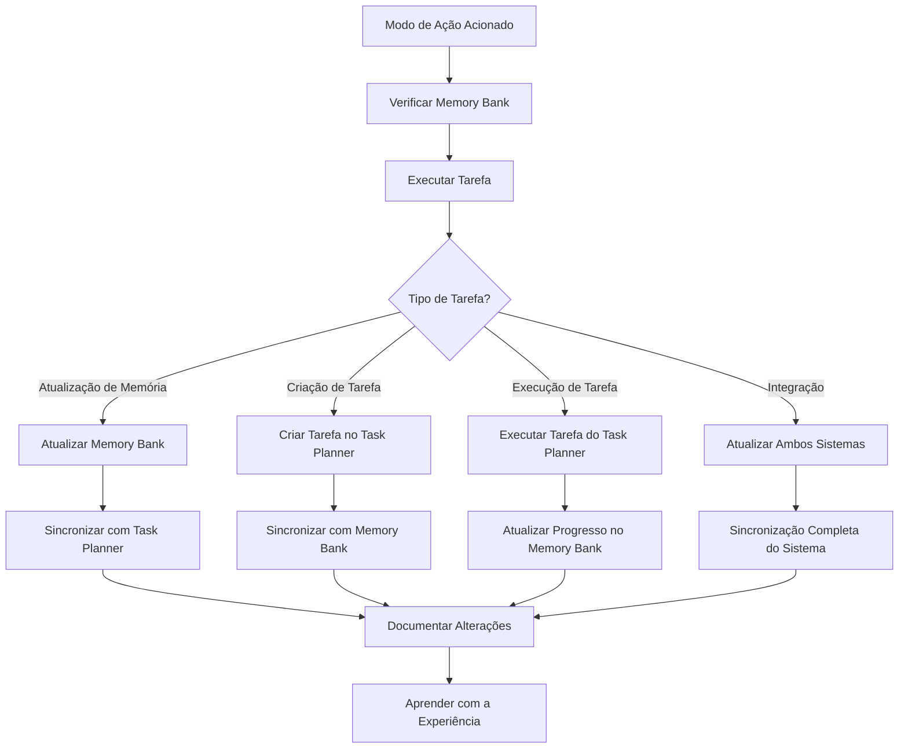

## Fase 3: Operações do Task Planner

### 3.1 Criação e Gerenciamento de Tarefas

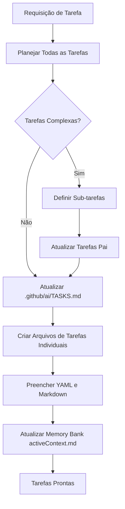

### 3.2 Fluxo de Execução de Tarefas

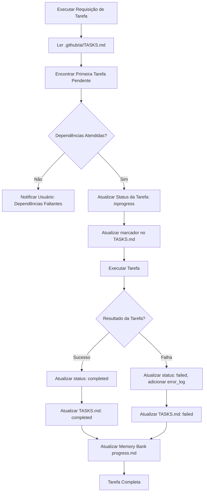

### 3.3 Fluxo de Arquivamento de Tarefas

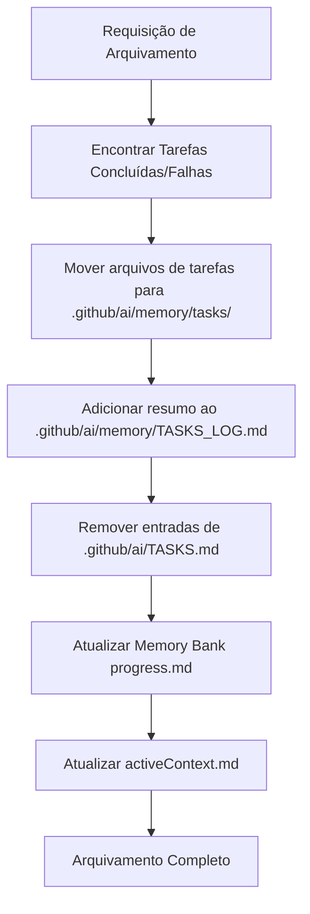

## Fase 4: Fluxos de Atualização do Memory Bank

### 4.1 Gatilhos de Atualização Automática

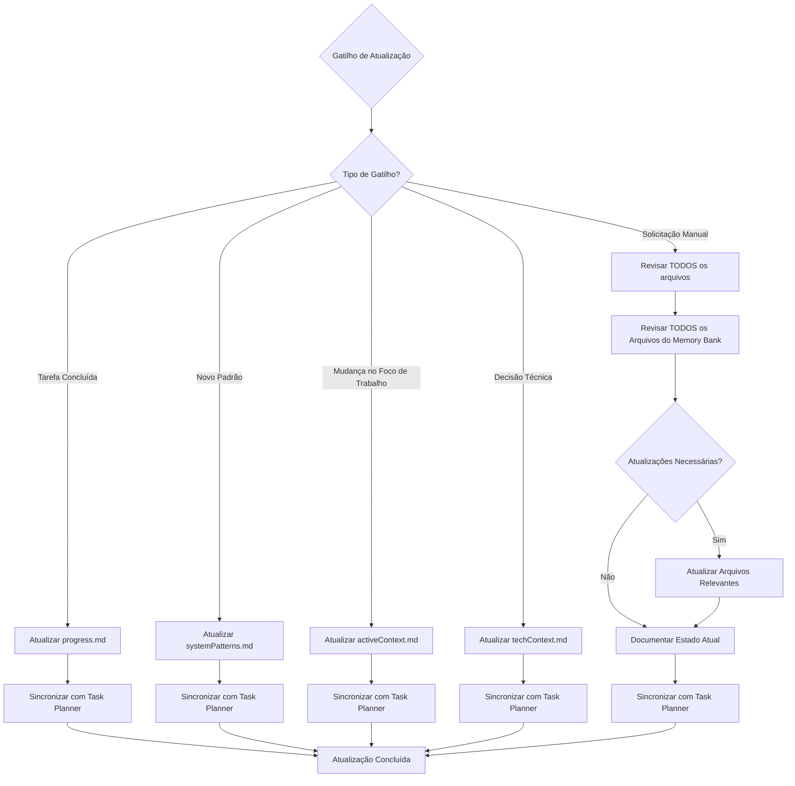

### 4.2 Processo de Atualização Manual do Memory Bank

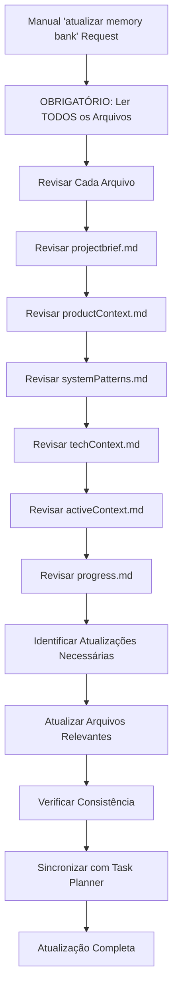

## Fase 5: Inteligência e Aprendizado do Projeto

### 5.1 Descoberta e Aprendizado de Padrões

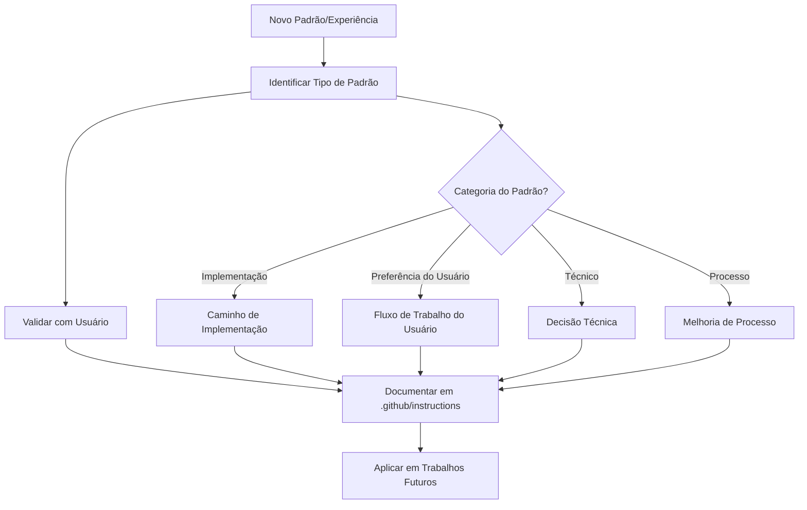

### 5.2 Ciclo de Melhoria Contínua

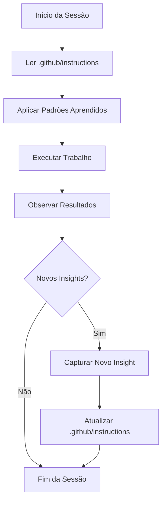

## Fase 6: Tratamento de Erros e Recuperação

### 6.1 Recuperação do Estado do Sistema

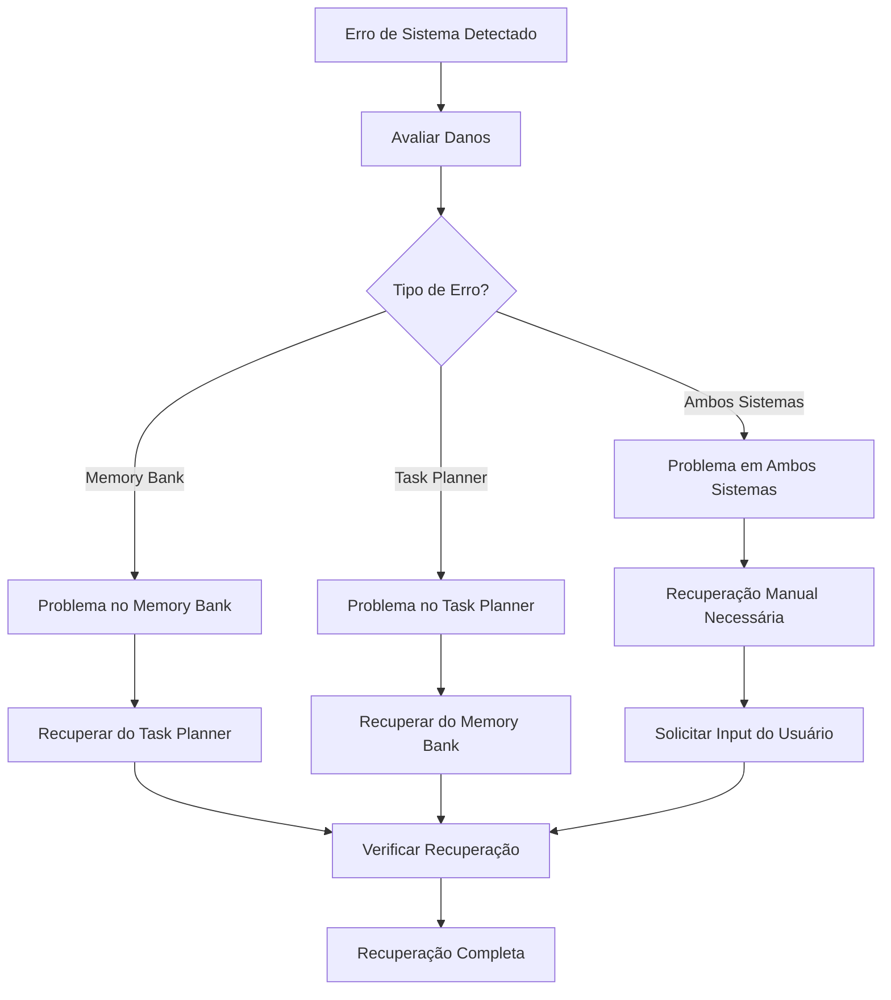

### 6.2 Verificações de Consistência de Dados

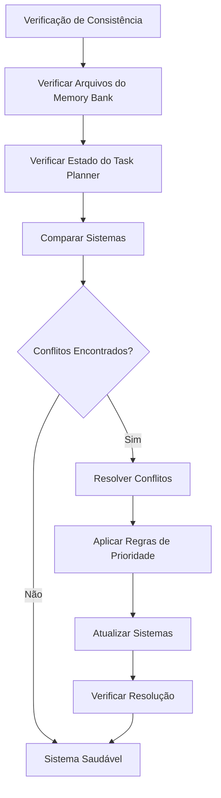

## Matriz de Responsabilidade do Sistema

### Separação Clara de Responsabilidades

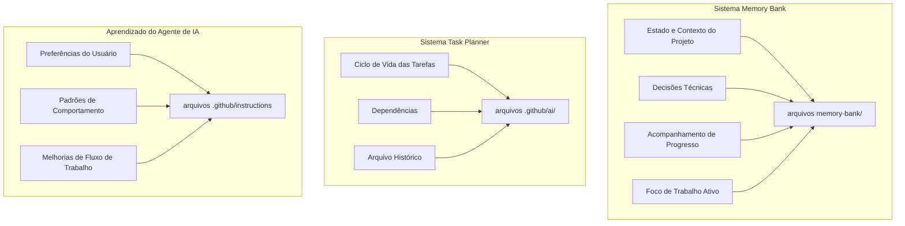

### Regras de Responsabilidade de Atualização

| Sistema | Atualiza | Nunca Atualiza |
|---------|----------|----------------|
| **Memory Bank** | Contexto do projeto, progresso, decisões técnicas | .github/instructions, arquivos de tarefas |
| **Task Planner** | Status de tarefas, dependências, arquivos | Arquivos do Memory Bank, .github/instructions |
| **Agente de IA** | .github/instructions com base na experiência | Conteúdo do Memory Bank, detalhes de tarefas |

### Limites de Fluxo de Dados

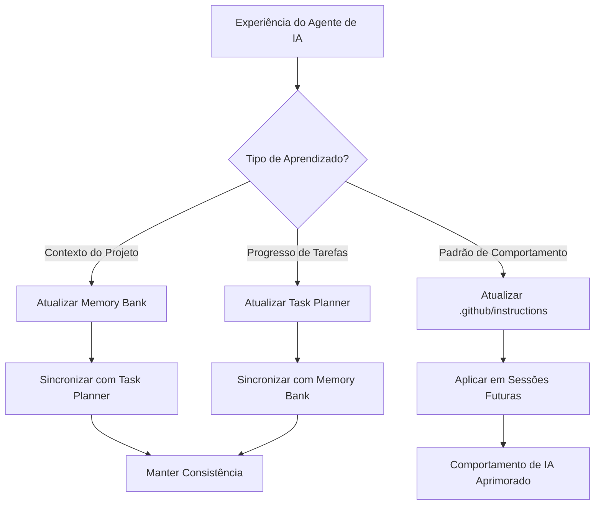

## Princípios Operacionais Chave

### 1. Abordagem Memory-First
- **Sempre ler arquivos do Memory Bank primeiro** no início da sessão
- **Memory Bank conduz todas as operações** com o Task Planner fornecendo suporte
- **Preservação de contexto** é crítica para operação eficaz da IA

### 2. Processamento de Comando Unificado
- **Ponto de entrada único** através do sistema Memory Bank
- **Sincronização automática** entre sistemas
- **Estado consistente** mantido em todas as operações

### 3. Aprendizado Contínuo
- **Reconhecimento de padrões** e documentação em .github/instructions
- **Inteligência do projeto** acumulada ao longo do tempo
- **Comportamento adaptativo** baseado em padrões aprendidos

### 4. Garantia de Qualidade
- **Revisões obrigatórias de arquivos** para operações críticas
- **Verificações de consistência** entre sistemas
- **Mecanismos de recuperação de erros** integrados

Este fluxo de trabalho unificado garante uma operação confiável, consistente e inteligente do agente de IA com memória persistente e capacidades de melhoria contínua. 